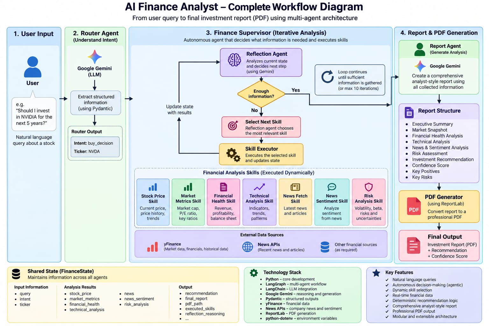

# 🚀 Autonomous Finance Analyst

An Autonomous Finance Analyst built using **LangGraph, Gemini, Agent Skills, and yFinance** for financial analysis, sentiment analysis, risk assessment, investment analysis, and automated PDF report generation.

---

# 🎯 Overview

This project simulates a professional financial analyst by autonomously gathering market information, evaluating company fundamentals, analyzing sentiment and risk, and generating an analyst-style report.

Unlike a traditional LLM application, the system **dynamically decides what information it needs** before producing the final output.

### ✨ Key Features

- 🧠 Autonomous, iterative financial analysis
- 🔄 Reflection-driven skill selection
- 🧩 Modular Agent Skills architecture
- 📊 Fundamental + technical + market analysis
- 📰 News retrieval and sentiment analysis
- ⚠️ Risk analysis
- 🗃️ Shared `FinanceState` across agents
- 📄 Automated professional PDF reports
- 🏗️ Modular and extensible LangGraph workflow

---

# 🧠 Architecture — Complete Workflow

The system follows:

**User Query → Router → Finance Supervisor → Reflection → Skill Selection → Skill Execution → State Update → Reflection → Report Agent → PDF**

The important part is that the analysis loop is **dynamic**. The system does not have to execute every skill in a fixed order. The Reflection Agent examines the current state and decides what information is still required.

### 🔄 End-to-End Workflow


### 🧩 Workflow at a glance

| Stage | Component | Responsibility |
|---|---|---|
| **1** | 👤 User | Provides a natural-language financial question |
| **2** | 🧭 Router Agent | Detects intent and extracts ticker |
| **3** | 🧠 Finance Supervisor | Coordinates autonomous analysis |
| **4** | 🔍 Reflection Agent | Evaluates the current state |
| **5** | 🎯 Skill Selection | Chooses the next relevant skill |
| **6** | ⚙️ Skill Executor | Executes the selected skill |
| **7** | 🗃️ FinanceState | Stores and shares analysis results |
| **8** | 📝 Report Agent | Generates the analyst-style report |
| **9** | 📄 PDF Generator | Converts the report into a PDF |

---

# 🤖 Agents

## 🧭 Router Agent

Uses **Gemini + Pydantic** to:

- Detect intent
- Extract ticker symbols
- Structure the user request
- Route the request into the finance workflow

Example:

```json
{
  "intent": "buy_decision",
  "ticker": "NVDA"
}
```

---

## 🧠 Finance Supervisor Agent

The central autonomous agent.

### Responsibilities

- Determine what information is currently available
- Identify missing analysis
- Select relevant skills
- Execute skills dynamically
- Maintain shared state
- Decide when enough information has been gathered
- Pass completed analysis to the reporting stage

---

## 🔍 Reflection Agent

Implements the iterative **Observe → Think → Act** style loop.

Instead of blindly running every skill, it evaluates the current state and determines the next useful action.

```text
Observe
   ↓
Evaluate current state
   ↓
What information is missing?
   ↓
Select next skill
   ↓
Execute skill
   ↓
Update FinanceState
   ↓
Reflect again
```

Example:

```json
{
  "enough_information": false,
  "next_skill": "financial_health_skill"
}
```

The loop continues until sufficient information has been collected or the configured iteration limit is reached.

---

## 📝 Report Agent

Generates a professional equity-research-style report from the collected analysis.

The report can contain:

- Executive Summary
- Market Snapshot
- Financial Health Analysis
- Technical Analysis
- News & Sentiment Analysis
- Risk Assessment
- Investment Analysis
- Confidence Score
- Key Positives
- Key Risks

---

# 🧩 Agent Skills

The project uses modular skills as reusable financial capabilities.

### 📈 Stock Price Skill

- Current Price
- Previous Close
- Price History
- Price Trends

**Source:** yFinance

### 📊 Market Metrics Skill

- Market Cap
- P/E Ratio
- Beta
- Sector
- Key valuation metrics

### 💰 Financial Health Skill

- Revenue
- Net Income
- Profit Margin
- Return on Equity
- Debt-to-Equity
- Balance-sheet information

### 📉 Technical Analysis Skill

- SMA50
- SMA200
- Trend Detection
- Technical patterns

### 📰 News Fetch Skill

- Company News
- Market Updates
- Recent Articles

### 💬 News Sentiment Skill

- Positive
- Neutral
- Negative
- Overall sentiment interpretation

### ⚠️ Risk Analysis Skill

- Volatility
- Beta Risk
- Financial Risk
- Market uncertainty

---

# 🔄 Autonomous Workflow

### Example Query

```text
Should I invest $10,000 in NVDA for the next 5 years?
```

A possible execution flow:

```text
User Query
    ↓
Router Agent
    ↓
Finance Supervisor
    ↓
Reflection
    ↓
Stock Price Skill
    ↓
Update FinanceState
    ↓
Reflection
    ↓
Financial Health Skill
    ↓
Update FinanceState
    ↓
Reflection
    ↓
News Fetch / Sentiment Skill
    ↓
Update FinanceState
    ↓
Reflection
    ↓
Risk Analysis Skill
    ↓
Update FinanceState
    ↓
Reflection
    ↓
Enough Information
    ↓
Report Agent
    ↓
PDF Generator
    ↓
Investment Report
```

> **Important:** This is an example execution path. The actual skill sequence is dynamic and can change according to the information already available in `FinanceState`.

---

# 🗃️ Shared State — `FinanceState`

The agents communicate through a shared state that maintains information throughout the workflow.

```text
FinanceState
│
├── Input Information
│   ├── query
│   ├── intent
│   └── ticker
│
├── Analysis Results
│   ├── stock_price
│   ├── market_metrics
│   ├── financial_health
│   ├── technical_analysis
│   ├── news
│   ├── news_sentiment
│   └── risk_analysis
│
└── Output
    ├── recommendation
    ├── final_report
    ├── pdf_path
    ├── executed_skills
    └── reflection_reasoning
```

This allows each skill to contribute information without tightly coupling the individual agents.

---

# 📄 Output

The system generates:

- Investment Recommendation
- Confidence Score
- Explainable Analysis
- Key Positives and Risks
- Professional PDF Report

Example:

```text
Recommendation: BUY

Confidence: 84%
```

> The values above are illustrative example output, not a current market assessment.

---

# 🛠️ Tech Stack

### 🤖 AI & Agentic Framework

- **LangGraph** — workflow orchestration and stateful agent execution
- **LangChain** — LLM integration
- **Google Gemini 2.5 Flash** — reasoning and generation
- **Pydantic** — structured outputs and validation

### 📊 Data Sources

- **yFinance** — market, financial, and historical data
- **News APIs** — recent financial/company news

### 🐍 Backend

- **Python**
- **Pydantic**

### 📄 Reporting

- **ReportLab** — PDF report generation

---

# 📂 Project Structure

```text
AI_FINANCE_ANALYST
│
├── agents/
│   ├── router_agent.py
│   ├── finance_supervisor_agent.py
│   ├── reflection_agent.py
│   └── report_agent.py
│
├── graph/
│   ├── workflow.py
│   └── skill_executor.py
│
├── skills/
│   ├── stock_price_skill.py
│   ├── market_metrics_skill.py
│   ├── financial_health_skill.py
│   ├── technical_analysis_skill.py
│   ├── news_fetch_skill.py
│   ├── news_sentiment_skill.py
│   ├── risk_analysis_skill.py
│   ├── investment_summary_skill.py
│   └── pdf_report_skill.py
│
├── schemas/
│   ├── router_schema.py
│   └── reflection_schema.py
│
├── state/
│   └── finance_state.py
│
├── tools/
│   ├── news_tool.py
│   ├── technical_tool.py
│   └── yfinance_tool.py
│
├── prompts/
│   ├── router_prompt.py
│   ├── reflection_prompt.py
│   └── report_prompt.py
│
├── main.py
├── llm.py
└── requirements.txt
```

---

# 🔮 Future Enhancements

- 🔎 Multi-Stock Comparison
- 📊 Portfolio Construction
- 📈 Interactive Dashboard
- ⚡ Real-Time Market Streaming
- 📉 Advanced Technical Indicators
- 🧠 Additional Agent Skills
- 📑 More advanced research-report templates

---

# 👨‍💻 Author

**Jayant Singh Khanna**

Computer Engineering Student | Machine Learning Intern | Agentic AI Developer
